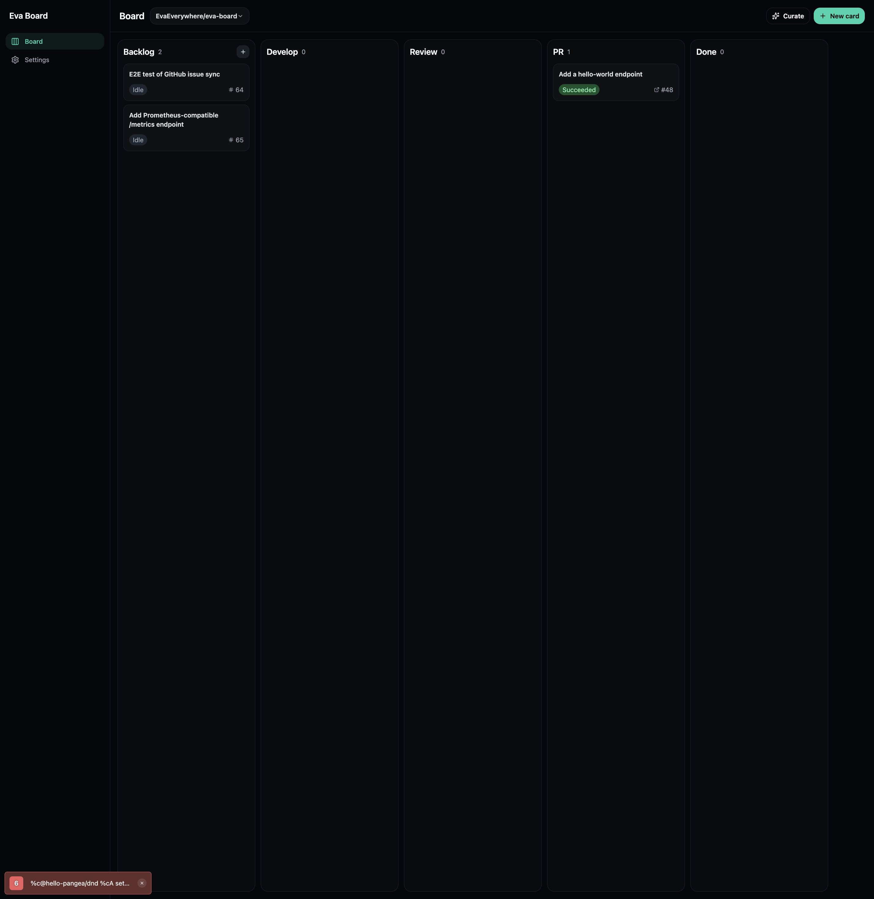

# Eva Board

[](https://github.com/EvaEverywhere/eva-board/actions/workflows/backend.yml)
[](https://github.com/EvaEverywhere/eva-board/actions/workflows/mobile.yml)

**📖 [Documentation site](https://evaeverywhere.github.io/eva-board/)**

Autonomous dev board — builds, verifies, reviews, and ships code without you in the loop.

## Screenshot



> 📺 Full demo recording coming soon. See the [autonomous loop walkthrough](#how-it-works) below or jump to [Quickstart](#quickstart).

## How it works

Tools like Vibe Kanban make humans faster at reviewing agent work. Eva Board removes humans from the loop entirely. The agent verifies against acceptance criteria, self-reviews its own diff, retries on failure, and creates the PR.

```
┌─────────────────────────────────────────────────────────┐
│                                                         │
│   Create card ──► Develop ──► Verify ──► Review ──► PR  │
│       ▲                         │          │            │
│       │                         ▼          ▼            │
│       │                     ┌──────────────────┐        │
│       │                     │  Failed? Retry   │        │
│       │                     │  with feedback    │        │
│       │                     └──────────────────┘        │
│                                                         │
└─────────────────────────────────────────────────────────┘
```

1. Create a card with acceptance criteria
2. Move to "Develop" — agent starts automatically
3. Agent codes, commits, pushes
4. The agent scores itself against your acceptance criteria
5. A second agent session reviews the diff for quality — fresh context, no self-bias
6. Failed either check? Agent retries with the feedback automatically
7. Both pass? PR opened on GitHub automatically

Plus autonomous backlog maintenance: triage analyzes your repo and proposes new issues; spring clean finds orphan branches and stale worktrees.

## Quickstart

**Prerequisites:** Go 1.23+, Node 20+, Docker, a coding agent CLI (Claude Code, etc.)

```bash
git clone https://github.com/EvaEverywhere/eva-board.git
cd eva-board
cp .env.example .env
# Fill in TOKEN_ENCRYPTION_KEY (verification + review run through Codegen)
make up
# Open http://localhost:8081
```

## Tech Stack

| Layer | Technology |
|-------|------------|
| Backend | Go 1.23, Fiber, pgx, PostgreSQL 16 |
| Frontend | Expo (web), React, NativeWind |
| Auth | Email magic-link (passwordless) |
| Agents | Pluggable: Claude Code, any CLI agent |
| LLM / Reviewer | Codegen agent (Claude Code default; pluggable to Codex, Aider, OpenHands, Cline, or any CLI) |
| CI | GitHub Actions |

## Mobile (iOS / Android)

Eva Board ships as a React Native app. To install on your phone and develop with hot-reload from your Mac, see [docs/mobile.md](docs/mobile.md).

The backend URL can be changed at runtime from **Settings → Backend** in the app — no rebuild needed when switching between localhost, ngrok, or a deployed instance.

## Documentation

- **[Documentation site](https://evaeverywhere.github.io/eva-board/)** — full docs: quickstart, concepts, self-hosting, architecture, mobile.
- [docs/self-hosting.md](docs/self-hosting.md) — deploy with Docker Compose or a single binary, reverse proxy, backups, agent CLI setup, GitHub webhook setup.
- [docs/architecture.md](docs/architecture.md) — system overview, the autonomous loop, package map, data model, SSE design, security model.
- [CONTRIBUTING.md](CONTRIBUTING.md) — development setup and PR conventions.
- [CODE_OF_CONDUCT.md](CODE_OF_CONDUCT.md) — Contributor Covenant 2.1 community guidelines.
- [SECURITY.md](SECURITY.md) — vulnerability disclosure policy.
- [THIRD_PARTY_NOTICES.md](THIRD_PARTY_NOTICES.md) — third-party dependency licenses redistributed with Eva Board.
- [CLAUDE.md](CLAUDE.md) — repository tour for Claude Code and other coding agents.

## License

Apache-2.0 — see [LICENSE](LICENSE)
